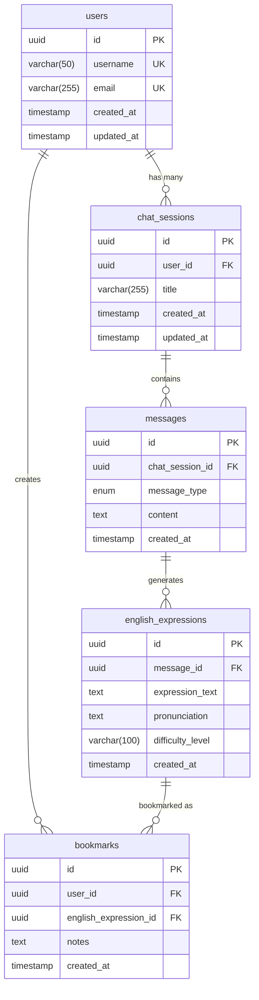

# 英語学習チャットシステム DB 設計書

## 1. 概要

### 1.1. 目的

本文書は、英語学習チャットシステムのデータベース設計について記載します。要件定義書に基づき、システムに必要なテーブル構成、リレーション、制約を定義します。

### 1.2. データベース管理システム

- **DBMS**: PostgreSQL 15.x 以上を推奨
- **文字エンコーディング**: UTF-8
- **タイムゾーン**: UTC

## 2. ER 図



## 3. テーブル設計

### 3.1. users（ユーザー）

ユーザー情報を管理するテーブル

| カラム名   | データ型     | 制約                                | 説明                    |
| ---------- | ------------ | ----------------------------------- | ----------------------- |
| id         | UUID         | PRIMARY KEY                         | ユーザー ID（自動生成） |
| username   | VARCHAR(50)  | UNIQUE, NOT NULL                    | ユーザー名              |
| email      | VARCHAR(255) | UNIQUE, NOT NULL                    | メールアドレス          |
| created_at | TIMESTAMP    | NOT NULL, DEFAULT CURRENT_TIMESTAMP | 作成日時                |
| updated_at | TIMESTAMP    | NOT NULL, DEFAULT CURRENT_TIMESTAMP | 更新日時                |

**インデックス:**

- PRIMARY KEY: id
- UNIQUE INDEX: username
- UNIQUE INDEX: email

### 3.2. chat_sessions（チャットセッション）

チャット会話のセッションを管理するテーブル

| カラム名   | データ型     | 制約                                | 説明                                               |
| ---------- | ------------ | ----------------------------------- | -------------------------------------------------- |
| id         | UUID         | PRIMARY KEY                         | セッション ID（自動生成）                          |
| user_id    | UUID         | FOREIGN KEY, NOT NULL               | ユーザー ID                                        |
| title      | VARCHAR(255) | NULL                                | セッションタイトル（最初のメッセージから自動生成） |
| created_at | TIMESTAMP    | NOT NULL, DEFAULT CURRENT_TIMESTAMP | 作成日時                                           |
| updated_at | TIMESTAMP    | NOT NULL, DEFAULT CURRENT_TIMESTAMP | 更新日時                                           |

**外部キー制約:**

- user_id → users(id) ON DELETE CASCADE

**インデックス:**

- PRIMARY KEY: id
- INDEX: user_id
- INDEX: created_at

### 3.3. messages（メッセージ）

チャット内のメッセージを管理するテーブル

| カラム名        | データ型  | 制約                                | 説明                                                    |
| --------------- | --------- | ----------------------------------- | ------------------------------------------------------- |
| id              | UUID      | PRIMARY KEY                         | メッセージ ID（自動生成）                               |
| chat_session_id | UUID      | FOREIGN KEY, NOT NULL               | チャットセッション ID                                   |
| message_type    | ENUM      | NOT NULL                            | メッセージタイプ（'user', 'ai_welcome', 'ai_response'） |
| content         | TEXT      | NOT NULL                            | メッセージ内容                                          |
| created_at      | TIMESTAMP | NOT NULL, DEFAULT CURRENT_TIMESTAMP | 作成日時                                                |

**ENUM 定義:**

```sql
CREATE TYPE message_type_enum AS ENUM ('user', 'ai_welcome', 'ai_response');
```

**外部キー制約:**

- chat_session_id → chat_sessions(id) ON DELETE CASCADE

**インデックス:**

- PRIMARY KEY: id
- INDEX: chat_session_id
- INDEX: created_at

### 3.4. english_expressions（英語表現）

AI が提案する英語表現を管理するテーブル

| カラム名         | データ型     | 制約                                | 説明                                                   |
| ---------------- | ------------ | ----------------------------------- | ------------------------------------------------------ |
| id               | UUID         | PRIMARY KEY                         | 表現 ID（自動生成）                                    |
| message_id       | UUID         | FOREIGN KEY, NOT NULL               | 関連するメッセージ ID                                  |
| expression_text  | TEXT         | NOT NULL                            | 英語表現テキスト                                       |
| pronunciation    | TEXT         | NULL                                | 発音記号（IPA 記法）                                   |
| difficulty_level | VARCHAR(100) | NULL                                | 難易度レベル（'beginner', 'intermediate', 'advanced'） |
| created_at       | TIMESTAMP    | NOT NULL, DEFAULT CURRENT_TIMESTAMP | 作成日時                                               |

**外部キー制約:**

- message_id → messages(id) ON DELETE CASCADE

**インデックス:**

- PRIMARY KEY: id
- INDEX: message_id
- INDEX: difficulty_level

### 3.5. bookmarks（ブックマーク）

ユーザーがブックマークした英語表現を管理するテーブル

| カラム名              | データ型  | 制約                                | 説明                         |
| --------------------- | --------- | ----------------------------------- | ---------------------------- |
| id                    | UUID      | PRIMARY KEY                         | ブックマーク ID（自動生成）  |
| user_id               | UUID      | FOREIGN KEY, NOT NULL               | ユーザー ID                  |
| english_expression_id | UUID      | FOREIGN KEY, NOT NULL               | 英語表現 ID                  |
| notes                 | TEXT      | NULL                                | ユーザーのメモ（将来拡張用） |
| created_at            | TIMESTAMP | NOT NULL, DEFAULT CURRENT_TIMESTAMP | 作成日時                     |

**外部キー制約:**

- user_id → users(id) ON DELETE CASCADE
- english_expression_id → english_expressions(id) ON DELETE CASCADE

**インデックス:**

- PRIMARY KEY: id
- UNIQUE INDEX: (user_id, english_expression_id) ※重複ブックマーク防止
- INDEX: user_id
- INDEX: created_at

## 4. データベース制約

### 4.1. 制約一覧

| テーブル  | 制約名                        | 制約タイプ | 対象カラム                       | 説明                                             |
| --------- | ----------------------------- | ---------- | -------------------------------- | ------------------------------------------------ |
| users     | users_username_key            | UNIQUE     | username                         | ユーザー名の重複防止                             |
| users     | users_email_key               | UNIQUE     | email                            | メールアドレスの重複防止                         |
| bookmarks | bookmarks_user_expression_key | UNIQUE     | (user_id, english_expression_id) | 同一ユーザーによる同一表現の重複ブックマーク防止 |

### 4.2. 外部キー制約

```sql
-- chat_sessions テーブル
ALTER TABLE chat_sessions
ADD CONSTRAINT fk_chat_sessions_user_id
FOREIGN KEY (user_id) REFERENCES users(id) ON DELETE CASCADE;

-- messages テーブル
ALTER TABLE messages
ADD CONSTRAINT fk_messages_chat_session_id
FOREIGN KEY (chat_session_id) REFERENCES chat_sessions(id) ON DELETE CASCADE;

-- english_expressions テーブル
ALTER TABLE english_expressions
ADD CONSTRAINT fk_english_expressions_message_id
FOREIGN KEY (message_id) REFERENCES messages(id) ON DELETE CASCADE;

-- bookmarks テーブル
ALTER TABLE bookmarks
ADD CONSTRAINT fk_bookmarks_user_id
FOREIGN KEY (user_id) REFERENCES users(id) ON DELETE CASCADE;

ALTER TABLE bookmarks
ADD CONSTRAINT fk_bookmarks_english_expression_id
FOREIGN KEY (english_expression_id) REFERENCES english_expressions(id) ON DELETE CASCADE;
```

## 5. DDL（テーブル作成文）

### 5.1. 基本テーブル作成

```sql
-- UUIDエクステンション有効化
CREATE EXTENSION IF NOT EXISTS "uuid-ossp";

-- ENUMタイプ定義
CREATE TYPE message_type_enum AS ENUM ('user', 'ai_welcome', 'ai_response');

-- usersテーブル
CREATE TABLE users (
    id UUID PRIMARY KEY DEFAULT uuid_generate_v4(),
    username VARCHAR(50) UNIQUE NOT NULL,
    email VARCHAR(255) UNIQUE NOT NULL,
    created_at TIMESTAMP NOT NULL DEFAULT CURRENT_TIMESTAMP,
    updated_at TIMESTAMP NOT NULL DEFAULT CURRENT_TIMESTAMP
);

-- chat_sessionsテーブル
CREATE TABLE chat_sessions (
    id UUID PRIMARY KEY DEFAULT uuid_generate_v4(),
    user_id UUID NOT NULL,
    title VARCHAR(255),
    created_at TIMESTAMP NOT NULL DEFAULT CURRENT_TIMESTAMP,
    updated_at TIMESTAMP NOT NULL DEFAULT CURRENT_TIMESTAMP,
    CONSTRAINT fk_chat_sessions_user_id
        FOREIGN KEY (user_id) REFERENCES users(id) ON DELETE CASCADE
);

-- messagesテーブル
CREATE TABLE messages (
    id UUID PRIMARY KEY DEFAULT uuid_generate_v4(),
    chat_session_id UUID NOT NULL,
    message_type message_type_enum NOT NULL,
    content TEXT NOT NULL,
    created_at TIMESTAMP NOT NULL DEFAULT CURRENT_TIMESTAMP,
    CONSTRAINT fk_messages_chat_session_id
        FOREIGN KEY (chat_session_id) REFERENCES chat_sessions(id) ON DELETE CASCADE
);

-- english_expressionsテーブル
CREATE TABLE english_expressions (
    id UUID PRIMARY KEY DEFAULT uuid_generate_v4(),
    message_id UUID NOT NULL,
    expression_text TEXT NOT NULL,
    pronunciation TEXT,
    difficulty_level VARCHAR(100),
    created_at TIMESTAMP NOT NULL DEFAULT CURRENT_TIMESTAMP,
    CONSTRAINT fk_english_expressions_message_id
        FOREIGN KEY (message_id) REFERENCES messages(id) ON DELETE CASCADE
);

-- bookmarksテーブル
CREATE TABLE bookmarks (
    id UUID PRIMARY KEY DEFAULT uuid_generate_v4(),
    user_id UUID NOT NULL,
    english_expression_id UUID NOT NULL,
    notes TEXT,
    created_at TIMESTAMP NOT NULL DEFAULT CURRENT_TIMESTAMP,
    CONSTRAINT fk_bookmarks_user_id
        FOREIGN KEY (user_id) REFERENCES users(id) ON DELETE CASCADE,
    CONSTRAINT fk_bookmarks_english_expression_id
        FOREIGN KEY (english_expression_id) REFERENCES english_expressions(id) ON DELETE CASCADE,
    CONSTRAINT bookmarks_user_expression_key
        UNIQUE (user_id, english_expression_id)
);
```

### 5.2. インデックス作成

```sql
-- chat_sessions インデックス
CREATE INDEX idx_chat_sessions_user_id ON chat_sessions(user_id);
CREATE INDEX idx_chat_sessions_created_at ON chat_sessions(created_at);

-- messages インデックス
CREATE INDEX idx_messages_chat_session_id ON messages(chat_session_id);
CREATE INDEX idx_messages_created_at ON messages(created_at);

-- english_expressions インデックス
CREATE INDEX idx_english_expressions_message_id ON english_expressions(message_id);
CREATE INDEX idx_english_expressions_difficulty_level ON english_expressions(difficulty_level);

-- bookmarks インデックス
CREATE INDEX idx_bookmarks_user_id ON bookmarks(user_id);
CREATE INDEX idx_bookmarks_created_at ON bookmarks(created_at);
```

### 5.3. トリガー（updated_at 自動更新）

```sql
-- updated_at自動更新用関数
CREATE OR REPLACE FUNCTION update_updated_at_column()
RETURNS TRIGGER AS $$
BEGIN
    NEW.updated_at = CURRENT_TIMESTAMP;
    RETURN NEW;
END;
$$ language 'plpgsql';

-- usersテーブルにトリガー適用
CREATE TRIGGER update_users_updated_at
    BEFORE UPDATE ON users
    FOR EACH ROW EXECUTE FUNCTION update_updated_at_column();

-- chat_sessionsテーブルにトリガー適用
CREATE TRIGGER update_chat_sessions_updated_at
    BEFORE UPDATE ON chat_sessions
    FOR EACH ROW EXECUTE FUNCTION update_updated_at_column();
```

## 6. サンプルクエリ

### 6.1. 基本的なデータ操作

```sql
-- ユーザー作成
INSERT INTO users (username, email)
VALUES ('john_doe', 'john@example.com');

-- チャットセッション作成
INSERT INTO chat_sessions (user_id, title)
VALUES ('ユーザーID', '会議で使える英語表現について');

-- ユーザーメッセージ追加
INSERT INTO messages (chat_session_id, message_type, content)
VALUES ('セッションID', 'user', 'お疲れ様ですの英語表現を教えて');

-- AI応答メッセージ追加
INSERT INTO messages (chat_session_id, message_type, content)
VALUES ('セッションID', 'ai_response', 'いくつかの表現を提案します');

-- 英語表現追加
INSERT INTO english_expressions (message_id, expression_text, difficulty_level)
VALUES
    ('メッセージID', 'Good job today!', 'beginner'),
    ('メッセージID', 'Thank you for your hard work.', 'intermediate'),
    ('メッセージID', 'I appreciate all your efforts today.', 'advanced');

-- ブックマーク追加
INSERT INTO bookmarks (user_id, english_expression_id)
VALUES ('ユーザーID', '英語表現ID');
```

### 6.2. 検索クエリ

```sql
-- ユーザーのブックマーク一覧取得
SELECT
    b.id as bookmark_id,
    e.expression_text,
    e.pronunciation,
    e.difficulty_level,
    b.created_at as bookmarked_at
FROM bookmarks b
JOIN english_expressions e ON b.english_expression_id = e.id
WHERE b.user_id = 'ユーザーID'
ORDER BY b.created_at DESC;

-- チャット履歴取得（英語表現含む）
SELECT
    m.id,
    m.message_type,
    m.content,
    m.created_at,
    array_agg(
        json_build_object(
            'id', e.id,
            'expression_text', e.expression_text,
            'pronunciation', e.pronunciation,
            'difficulty_level', e.difficulty_level,
            'is_bookmarked', CASE WHEN b.id IS NOT NULL THEN true ELSE false END
        )
    ) FILTER (WHERE e.id IS NOT NULL) as expressions
FROM messages m
LEFT JOIN english_expressions e ON m.id = e.message_id
LEFT JOIN bookmarks b ON e.id = b.english_expression_id AND b.user_id = 'ユーザーID'
WHERE m.chat_session_id = 'セッションID'
GROUP BY m.id, m.message_type, m.content, m.created_at
ORDER BY m.created_at ASC;
```

## 7. パフォーマンス考慮事項

### 7.1. インデックス戦略

- **主キー**: すべてのテーブルで UUID を使用し、自動的にクラスター化インデックスが作成される
- **外部キー**: 結合頻度の高いカラムにインデックスを設定
- **検索用途**: created_at カラムで時系列検索を高速化

### 7.2. パーティショニング（将来対応）

- **messages テーブル**: 大量データ蓄積時は月次パーティショニングを検討
- **bookmarks テーブル**: ユーザー数増加時は user_id でのパーティショニングを検討

### 7.3. データ保持期間

- **chat_sessions, messages**: 無制限（ユーザーが削除するまで保持）
- **english_expressions**: メッセージと連動して削除
- **bookmarks**: ユーザーが明示的に削除するまで永続保持

## 8. セキュリティ考慮事項

### 8.1. データアクセス制御

- アプリケーションレベルでのユーザー認証・認可
- データベースユーザーは最小権限の原則に従う
- 個人情報（email 等）の暗号化を検討

### 8.2. データ整合性

- 外部キー制約によるデータ整合性の保証
- トランザクション処理でのデータ一貫性確保
- 定期的なデータバックアップとリストア手順の確立

---

**更新履歴**

- 2024-12-XX: 初版作成
